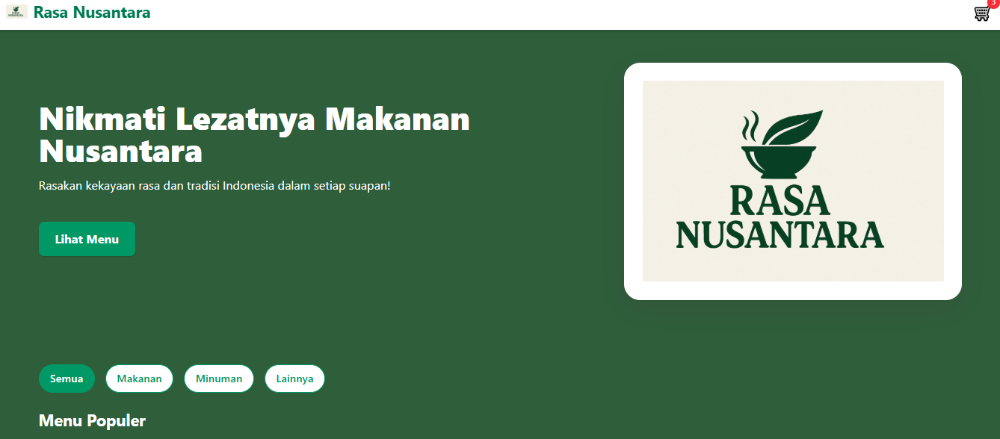
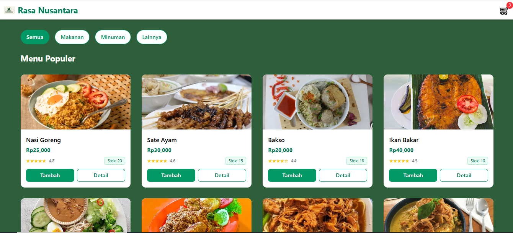
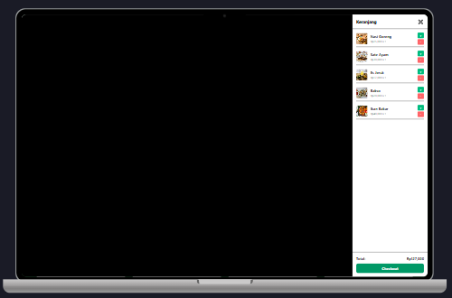
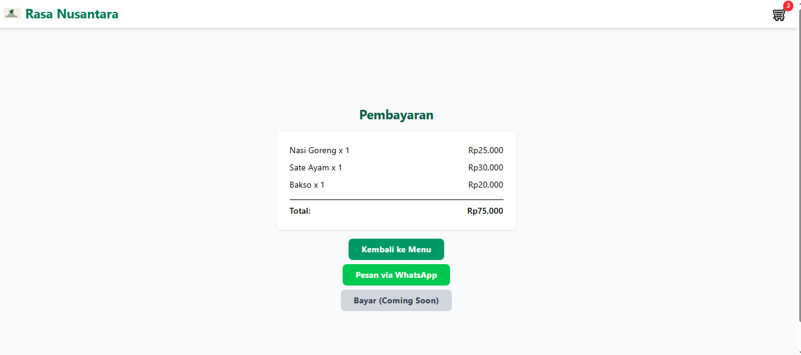

# Rasa Nusantara 🍲

## 📸 Preview

**Halaman Home**


**Halaman Menu**


**Halaman Checkout**


**Halaman Pembayaran**



**Rasa Nusantara** adalah website kuliner yang menghadirkan berbagai makanan khas Indonesia lengkap dengan deskripsi dan gambar menarik.  
Dibangun menggunakan **React + Vite** dengan styling modern dari **Tailwind CSS**, website ini dirancang agar cepat, responsif, dan nyaman digunakan.

---

## ✨ Fitur
- 📜 Daftar makanan khas Indonesia beserta gambar & deskripsi
- 🎨 Desain modern & responsif untuk semua perangkat
- ⚡ Performa cepat berkat **React + Vite**
- 🔍 Navigasi dan pencarian mudah digunakan

---

## 🛠️ Teknologi yang Digunakan


---

## 📌 Tujuan
Memperkenalkan kekayaan kuliner nusantara melalui website modern yang interaktif dan mudah diakses oleh semua orang.

---

## 🚀 Cara Menjalankan Project
```bash
# Clone repository
git clone https://github.com/username/rasa-nusantara.git

# Masuk ke folder project
cd food-indo

# Install dependencies
npm install

# Jalankan development server
npm run dev
